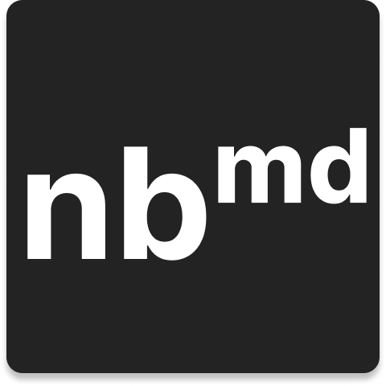

# Notebook

    

## Goal

Our project is creating a user-friendly note journaling app tailored to the needs of students, professionals, and researchers. It's designed to simplify note-taking and organization, providing an efficient digital solution for users to create, edit, and structure their notes.

## Application Installation

The installer for the application can be found in the source folder by the name `Notebook-5.0.0.dmg`. The application is built for macOS and can be installed by double-clicking the installer and following the on-screen instructions.

## Source Code Information

The application code is from a course and cannot be shared publicly. However, you can find the documentation of the project [here](https://melon-evening-cd9.notion.site/Notebook-md-e351c4a5bcfd49e9baf9fe0aa8f12341?pvs=4).

To access the application source code, please contact me (the developer) directly at [email](mailto:s22modi@uwaterloo.ca).
